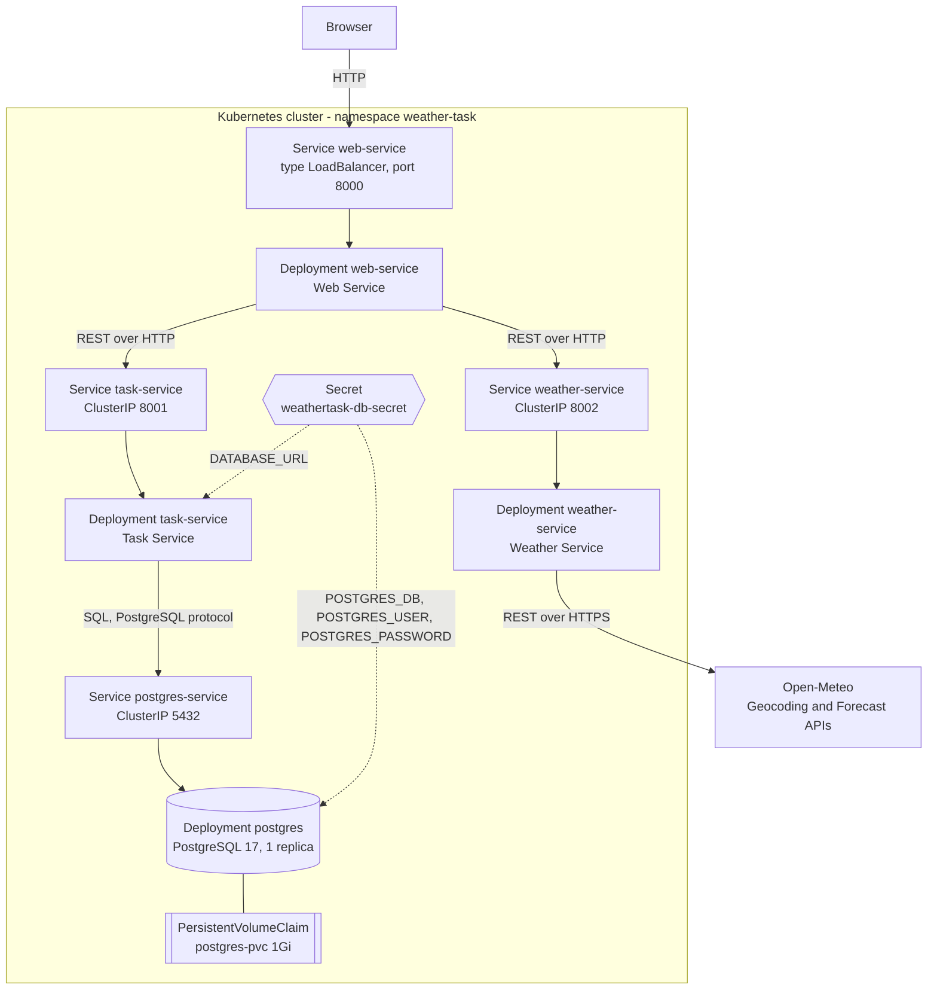
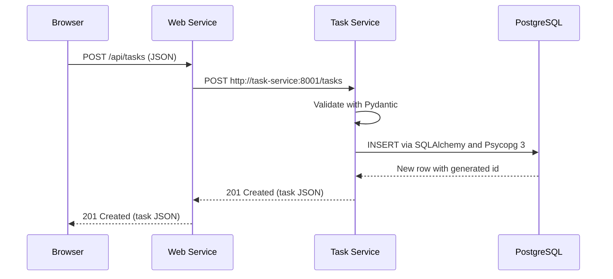
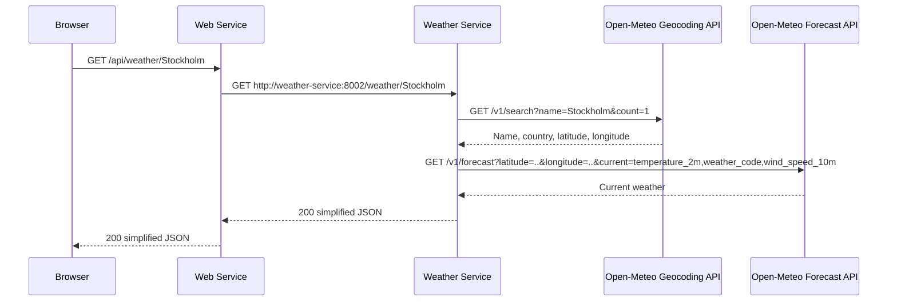

# WeatherTask: Architecture and Discussion

## 1. Purpose of the application

WeatherTask is a task planner for activities that depend on the weather. A user creates tasks such as "Go running" in "Stockholm" with an optional due date and sees the current weather for each task's city next to it. Tasks can be marked as completed, reopened and deleted.

The functional scope is deliberately small. The aim of the project is to show how such an application can be designed and operated as a set of cloud-native microservices on Kubernetes: separate services with their own REST APIs, a separate database with persistent storage, consumption of an external REST API and independent horizontal scaling.

## 2. Assignment requirements and where they are met

| Requirement | How it is met | Evidence from testing |
|---|---|---|
| Deployable with Kubernetes | Six manifests in `kubernetes/` (namespace, Secret, PostgreSQL, three services) | All four Deployments `1/1`, 0 restarts |
| At least two microservice types plus a database | Web Service, Task Service and Weather Service plus PostgreSQL | Four separate Deployments |
| REST API per microservice | FastAPI endpoints in every service (Section 5) | Swagger UI at `/docs` for each service |
| Accessible from a browser outside Kubernetes | `web-service` is a `LoadBalancer` Service | Browser at `http://localhost:8000` |
| Independent horizontal scaling | One Deployment per service, stateless services | Scaled web 2, task 3, weather 2 at the same time |
| Custom images on Docker Hub, used by Kubernetes | `karthika212/weather-task-*` images referenced by tag | Pod events show the images pulled from Docker Hub |
| Database as a separate service | PostgreSQL Deployment with the ClusterIP Service `postgres-service` | Only the Task Service connects to it |
| Persistent database storage | `postgres-pvc` (1Gi, ReadWriteOnce) mounted as the data directory | Task survived deleting the PostgreSQL pod |
| No database horizontal scaling required | PostgreSQL stays at one replica | - |
| Programmatic use of an external REST API | Weather Service calls the Open-Meteo Geocoding and Forecast APIs | Weather Service logs show both HTTPS requests |
| Own REST APIs | Task CRUD API, weather API and the Web Service API | Tested with curl, the browser and Swagger |

## 3. Architecture overview

The browser only ever talks to the Web Service. The Task Service, the Weather Service and PostgreSQL have ClusterIP Services and cannot be reached from outside the cluster. The Web Service acts as a simple gateway for the browser: it serves the user interface and forwards API calls to the right internal service.

## 4. Components and responsibilities

| Component | Responsibility | Does not do |
|---|---|---|
| **Web Service** | Serves `index.html` and `style.css`. Exposes `/api/tasks` and `/api/weather/{city}` and forwards them to the internal services. Turns unreachable downstream services into a controlled `503`. | Store tasks, validate task data, access the database or call Open-Meteo |
| **Task Service** | Owns the task data. Validates input with Pydantic, performs CRUD with SQLAlchemy and creates the `tasks` table on startup. | Know anything about weather or the UI |
| **Weather Service** | Resolves a city name to coordinates, fetches the current weather and returns a small, stable JSON response. Handles provider errors and retries one transient connection failure. | Store anything or know about tasks |
| **PostgreSQL** | Stores the `tasks` table on persistent storage. | Get accessed by anything other than the Task Service |
| **Browser UI** | Plain HTML, CSS and a small amount of JavaScript. Loads tasks and then the weather for each task separately. | Call internal services or Open-Meteo directly |

Each service holds no user data in memory between requests. Task data lives only in PostgreSQL and weather data is fetched on demand. This is what allows the three application services to be scaled horizontally.

## 5. Mapping of software components to deployed services

| Logical component | Source code | Docker image | Kubernetes Deployment | Kubernetes Service | Reachable from |
|---|---|---|---|---|---|
| User interface and API entry point | `web-service/app/` | `karthika212/weather-task-web:1.0` | `web-service` | `web-service` LoadBalancer `8000` | Outside the cluster |
| Task management | `task-service/app/` | `karthika212/weather-task-task:1.0` | `task-service` | `task-service` ClusterIP `8001` | Web Service only |
| Weather lookup | `weather-service/app/` | `karthika212/weather-task-weather:1.1` | `weather-service` | `weather-service` ClusterIP `8002` | Web Service only |
| Task storage | - | `postgres:17` | `postgres` (1 replica) | `postgres-service` ClusterIP `5432` | Task Service only |
| Database configuration | `kubernetes/secret.yaml` | - | - | Secret `weathertask-db-secret` | Task Service and PostgreSQL pods |
| Persistent data | - | - | - | PVC `postgres-pvc` (1Gi, RWO) | PostgreSQL pod |

### REST endpoints

| Service | Endpoints |
|---|---|
| Web Service | `GET /`, `GET /health`, `GET /api/tasks`, `POST /api/tasks`, `PATCH /api/tasks/{task_id}`, `DELETE /api/tasks/{task_id}`, `GET /api/weather/{city}` |
| Task Service | `GET /health`, `GET /tasks`, `POST /tasks`, `GET /tasks/{task_id}`, `PATCH /tasks/{task_id}`, `DELETE /tasks/{task_id}` |
| Weather Service | `GET /health`, `GET /weather/{city}` |

## 6. Communication patterns

All communication between the application services is **synchronous request-response over HTTP using JSON (REST)**. Services find each other through **Kubernetes Service DNS names**, which are passed to the Web Service as environment variables (`TASK_SERVICE_URL=http://task-service:8001` and `WEATHER_SERVICE_URL=http://weather-service:8002`). No pod IP address is configured anywhere. Each Service load-balances across all ready pods of its Deployment.

The link between the Task Service and PostgreSQL is **not REST**. The Task Service uses SQLAlchemy with the Psycopg 3 driver and speaks the PostgreSQL wire protocol to `postgres-service:5432`. The connection string comes from the Secret.

The Weather Service consumes Open-Meteo **programmatically over HTTPS** with httpx. The browser never calls Open-Meteo, the Weather Service or the Task Service directly. In my browser test the only URLs requested were on `localhost:8000`.

### Creating a task

### Showing the weather for a task

The logs of the running pods confirm each hop. The Web Service logs `GET http://task-service:8001/tasks` and `GET http://weather-service:8002/weather/Stockholm`. The Task Service and Weather Service log the Web Service pod IP as the caller. The Weather Service logs both Open-Meteo HTTPS requests. PostgreSQL's `pg_stat_activity` shows the Task Service pod as its only client.

### Error handling between services

The Web Service passes downstream status codes through unchanged, so a `404` or `422` from the Task Service reaches the browser as it is. If a service cannot be reached within the 5 second timeout the Web Service returns `503`. The Weather Service maps provider problems to `503` (unreachable or provider 5xx) or `502` (an unusable response) and never returns a Python traceback.

The UI loads the task list and the weather separately. If weather fails, the task card is still shown with "Weather unavailable". I tested this in the Docker integration stage before Kubernetes by stopping each service container: with the Weather Service down, tasks still loaded; with the Task Service down, weather still worked and the Web Service kept running.

## 7. Kubernetes deployment design

| Resource | Design decision | Reason |
|---|---|---|
| Namespace `weather-task` | All resources in one namespace | Keeps the project separate and easy to remove |
| Secret `weathertask-db-secret` | Database name, user, password and `DATABASE_URL` | Keeps credentials out of images and Deployments |
| PVC `postgres-pvc` | 1Gi, `ReadWriteOnce`, default StorageClass (`standard`, local-path provisioner) | Database files survive pod restarts |
| Deployment `postgres` | 1 replica, `Recreate` strategy, `PGDATA` in a subdirectory of the volume | Two PostgreSQL processes must never use the same volume at once |
| Deployments for the three services | 1 replica each by default, `imagePullPolicy: IfNotPresent`, versioned image tags | Each can be scaled and updated on its own |
| Readiness and liveness probes | `GET /health` for the services, `pg_isready` over TCP for PostgreSQL | Traffic only reaches pods that are ready, and hung containers are restarted |
| Resource requests and limits | 50m CPU / 64Mi requested, 250m / 256Mi limit for the services. 100m / 128Mi and 500m / 512Mi for PostgreSQL | Predictable scheduling on a small cluster |
| `securityContext` | `runAsNonRoot: true`, `runAsUser: 1000`, `allowPrivilegeEscalation: false` | Containers cannot run as root |
| External exposure | Only `web-service`, as `type: LoadBalancer` on port 8000 | Single entry point, everything else internal |

I deliberately kept the `/health` endpoints independent of the database. If PostgreSQL is briefly unavailable, Kubernetes should not restart healthy Task Service pods because of it.

**Exposure: NodePort versus LoadBalancer.** In the first version of the manifest I exposed the Web Service as a NodePort on port 30080. Inside the cluster this worked, but Docker Desktop in kind mode runs the Kubernetes node as a hidden container that only publishes the API server port, so the NodePort could not be reached from Windows. Docker Desktop does provide LoadBalancer Services in kind mode, so I changed only the Service type of `web-service`. The other three Services remained ClusterIP. In the tested environment the application is reached at `http://localhost:8000`.

## 8. Persistence

PostgreSQL stores its data on `postgres-pvc`, which is bound to a 1Gi volume created by the cluster's default StorageClass. The container filesystem is therefore not the source of truth.

I tested this by creating the task "Kubernetes persistence test" through the browser and then deleting the PostgreSQL pod. Kubernetes created a replacement pod in about 13 seconds. It mounted the same PVC, and PostgreSQL logged that the data directory already contained a database and skipped initialisation. The task was still returned through the Web Service and visible in the browser, and the Task Service reconnected without restarting.

The tasks table is created by SQLAlchemy's `create_all` when the Task Service starts. This is acceptable for an assignment with one table. A production system would use versioned migrations, for example with Alembic.

## 9. Scalability

The three application services are stateless, so any replica can answer any request. Each has its own Deployment and can be scaled on its own with `kubectl scale`. This matches their different load profiles: the Weather Service mainly waits on an external API, the Task Service mainly waits on the database and the Web Service handles every browser request.

I tested manual scaling in the Kubernetes cluster:

| Deployment | Baseline | During test | After test |
|---|---|---|---|
| web-service | 1 | 2 | 1 |
| task-service | 1 | 3 | 1 |
| weather-service | 1 | 2 | 1 |
| postgres | 1 | 1 | 1 |

While scaled, the Service endpoints listed every new pod, the application kept working and the request logs showed traffic on every replica (for example 11, 5 and 1 requests on the three Task Service pods). Scaling is manual. No HorizontalPodAutoscaler is configured.

PostgreSQL is not scaled horizontally. Running several PostgreSQL pods on one volume would corrupt the data, and real replication needs a different setup. The single database is therefore both the main capacity limit and the main single point of failure of the system.

## 10. Resilience and the Weather Service retry

Every call between services and to Open-Meteo uses a 5 second timeout and turns failures into controlled HTTP errors. Stopping one service does not stop the others (Section 6).

During Kubernetes testing I observed that about 10-15% of HTTPS connections from inside the Docker Desktop kind cluster to Open-Meteo failed with TLS errors such as `WRONG_VERSION_NUMBER` and `UNEXPECTED_EOF_WHILE_READING`. The same code on the Windows host had no failures in 40 requests, and DNS answers were identical, so this is a problem in the outbound network path of the test environment rather than in the application.

To make the service more tolerant of this, I added a single retry in Weather Service 1.1:

- only `httpx.TransportError` is retried (connection, TLS, read, write, protocol errors and timeouts)
- at most 2 attempts, with a 0.4 second pause in between
- HTTP error responses from Open-Meteo, such as 4xx, are never retried
- if the second attempt also fails, the existing controlled `503` is returned

I measured 40 requests through the Web Service before and after the change: successful responses went from 32/40 with version 1.0 to 39/40 with version 1.1. The logs showed 8 first-attempt failures, of which 7 succeeded on retry. The retry reduces the effect of the network problem but does not fix it. It also cannot help when the first attempt takes the full 5 second timeout, because the Web Service's own 5 second timeout expires first.

## 11. Cloud architecture patterns and principles

- **Microservices with a single responsibility.** Tasks, weather and presentation are separate services that can be changed, deployed and scaled independently.
- **Gateway as the single entry point.** The Web Service is the only public component. It hides the internal structure from the browser and reduces the attack surface.
- **Database per service.** Only the Task Service owns and accesses the task data. Other services use its REST API.
- **Stateless services and externalised state.** State lives in PostgreSQL on a PVC, which makes the application containers disposable. I showed this by recreating all three application containers in Docker and the PostgreSQL pod in Kubernetes without losing data.
- **Service discovery through DNS.** Services use Kubernetes Service names instead of IP addresses.
- **Configuration through the environment.** URLs and credentials are injected at runtime from the manifest and the Secret. The same image runs locally in Docker and in Kubernetes.
- **Immutable, versioned images.** Images are tagged `1.0` and `1.1` and never `latest`, so a rollout is reproducible and a rollback is possible.
- **Health checks and self-healing.** Readiness and liveness probes let Kubernetes route traffic only to ready pods and replace failed ones.
- **Graceful degradation.** A weather failure only affects the weather line of a task card.
- **Bounded retry for transient faults.** One retry with a short delay, rather than unlimited retries that could overload a struggling provider.

## 12. Benefits

- Each service can be **scaled separately**. If weather lookups became the bottleneck, only the Weather Service would need more replicas.
- **Failures are isolated.** An Open-Meteo outage or a crashed Weather Service does not stop users from managing their tasks.
- **Independent deployment.** I updated the Weather Service from 1.0 to 1.1 with a rolling update without touching the other services.
- **Clear boundaries** make each service small enough to understand, test and replace. The Weather Service could switch to another provider without any change to the rest of the system.
- **Portability.** The same Docker images and manifests should run on any conformant Kubernetes cluster, although in this project they were only tested on Docker Desktop.

## 13. Challenges

Some challenges are general to microservices and some appeared directly during this project.

- **Operational complexity.** Four Deployments, four Services, a Secret and a PVC replace what could be one process and one database. Most of my development time went into packaging, networking and deployment rather than application features.
- **Network calls instead of function calls.** Every request crosses at least one network hop, which adds latency and new failure modes. Timeouts, status code mapping and the retry were needed only because of this.
- **Environment differences.** Several problems only appeared in specific environments:
  - Windows Smart App Control blocked the compiled PostgreSQL driver, so from the database stage onwards I ran the Task Service in Linux containers.
  - `localhost` resolved to IPv6 first on Windows and added about 2 seconds to every local call.
  - NodePorts were not reachable in Docker Desktop kind mode.
  - Outbound TLS connections from the kind cluster failed intermittently.
- **Distributed debugging.** Following one browser request means reading logs from several pods. The logs are good enough for this demonstration, but there is no central logging or tracing.
- **Data consistency.** Only one service owns data, so cross-service consistency was not an issue here. A larger system with several data-owning services would need to deal with it.
- **Kubernetes details.** For example, `runAsNonRoot` requires a numeric user id when the image user is a name, and the PostgreSQL Deployment needs the `Recreate` strategy to avoid two database processes on one volume.

## 14. Security

| Risk | Current mitigation | Remaining gap and possible improvement |
|---|---|---|
| Credentials exposed | Credentials are in a Kubernetes Secret, not in images or code. They are clearly marked as demo values. | The Secret file is committed to Git and Kubernetes Secrets are only base64-encoded. Production should use an external secrets manager or Sealed Secrets. |
| Unauthorised access to data | Only the Web Service is exposed. The Task Service and PostgreSQL are ClusterIP only. | There is no user authentication, so anyone who can reach the page can change all tasks. Authentication and per-user data would be needed. |
| Lateral movement inside the cluster | Services are small and only the Task Service has database credentials. | Any pod in the cluster can call any Service. NetworkPolicies could restrict traffic to the intended paths. |
| Unencrypted traffic | Calls to Open-Meteo use HTTPS. | Browser to Web Service and service-to-service traffic use plain HTTP. TLS at the entry point (for example through an Ingress with certificates) and possibly mutual TLS inside the cluster would address this. |
| Container compromise | Containers run as uid 1000 with `runAsNonRoot` and `allowPrivilegeEscalation: false`. Slim base images and no secrets in images. | A read-only root filesystem and dropped Linux capabilities could be added. |
| Malicious input | Pydantic validation in the Task Service, parameterised SQL through SQLAlchemy, URL-encoding of city names. The UI inserts user data with `textContent`, not as HTML. | No rate limiting. |
| Resource exhaustion | CPU and memory limits on every container. | No rate limiting at the entry point. |
| Supply chain | Official base images and pinned version tags for the custom images. | Images are not scanned or signed. Image scanning in a build pipeline would help. |
| Dependency on an external provider | Timeouts, the retry and controlled errors. | Weather data depends entirely on Open-Meteo's availability and terms of use. |

## 15. Business implications

**Costs.** Microservices need more infrastructure than a single application: several containers, a cluster, a container registry and more monitoring. For a small tool like WeatherTask this cost would be hard to justify. The architecture becomes valuable when parts of the system have very different load or change at different speeds.

**Teams and delivery.** Separate services allow separate teams to own and release their part independently, as the Weather Service update showed. This only pays off with several teams. For one developer the coordination overhead is higher than the benefit.

**Operations and skills.** Running Kubernetes requires skills in containers, networking, storage and security. A company would either need these skills in-house or pay for a managed Kubernetes service and a managed database.

**Vendor and provider risk.** Using Open-Meteo avoids building a weather data pipeline, but the product then depends on a third party's availability, limits and terms. According to the [official terms](https://open-meteo.com/en/terms), the free API is for non-commercial use and is currently limited to 10,000 calls per day, 5,000 per hour and 600 per minute. The data it returns is licensed under CC BY 4.0, which requires attribution. A commercial product would therefore need an appropriate paid API plan. The current UI does not yet display an Open-Meteo attribution, which should be added. The narrow Weather Service interface would make a change of provider easier.

**Portability.** Standard Docker images and Kubernetes manifests reduce lock-in to one cloud provider. The cluster-specific part is how the Web Service is exposed, as the difference between NodePort and LoadBalancer in Docker Desktop showed.

## 16. Would a monolith be better?

For WeatherTask as it is today, almost certainly yes. The application has one database table, two external calls and a single user interface. A single FastAPI application with one database would provide the same functionality with fewer moving parts, lower latency, simpler debugging and much less deployment code. It could still be containerised and run with several replicas behind a load balancer, because task data would still live in the database.

I chose the microservice split because the assignment is about demonstrating cloud architecture. It becomes reasonable when the parts have genuinely different requirements: for example if weather lookups needed caching and heavy scaling, if several teams worked on the product or if the weather provider changed often. A sensible real-world path would be to start with a well-structured monolith and extract services such as the Weather Service only when there is a concrete reason.

## 17. Limitations and future work

- **Automatic scaling.** Add a HorizontalPodAutoscaler for the three services based on CPU or request metrics. Only manual scaling has been tested.
- **Database.** Use a managed PostgreSQL service or a StatefulSet with replication and regular backups. Replace `create_all` with Alembic migrations.
- **Security.** Add authentication, TLS at the entry point, NetworkPolicies and external secret management (Section 14).
- **Entry point.** An Ingress controller would allow host-based routing and TLS certificates. I left it out to keep the deployment simple.
- **Observability.** Central logging and metrics (for example Prometheus and Grafana) and request tracing across services.
- **Automation.** A CI/CD pipeline to test, scan, build and push images and apply the manifests.
- **Timeout budget.** Align the Web Service and Weather Service timeouts so that a retry after a slow attempt can still finish within the Web Service's timeout.
- **Weather codes.** Map Open-Meteo weather codes to readable descriptions in the UI.

## 18. Conclusion

WeatherTask meets the assignment requirements with three independently deployable and scalable FastAPI microservices, a separate PostgreSQL database on persistent storage and programmatic use of the Open-Meteo REST API. It runs on Kubernetes from public Docker Hub images and is reached from a normal browser through a LoadBalancer Service. Deployment, scaling, persistence and failure handling were all tested on a running cluster. The project also showed the costs of the approach: much of the effort went into networking, packaging and environment problems rather than features, which is why a monolith would be the more practical choice for an application of this size in production.
